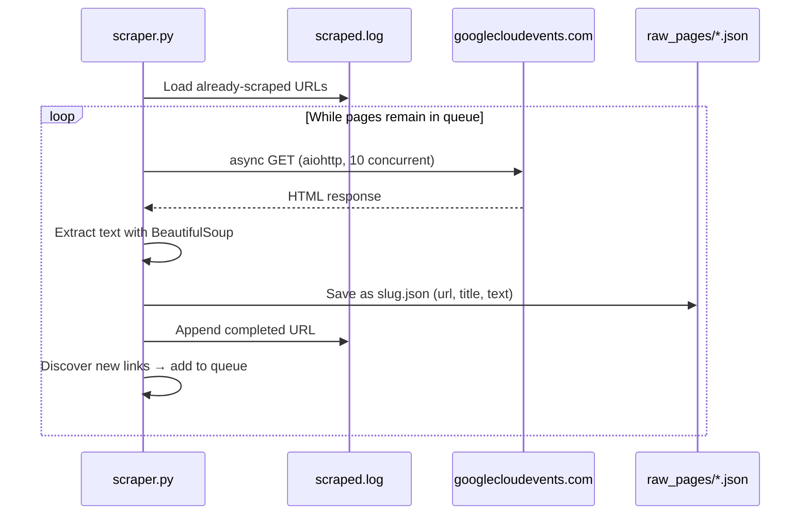
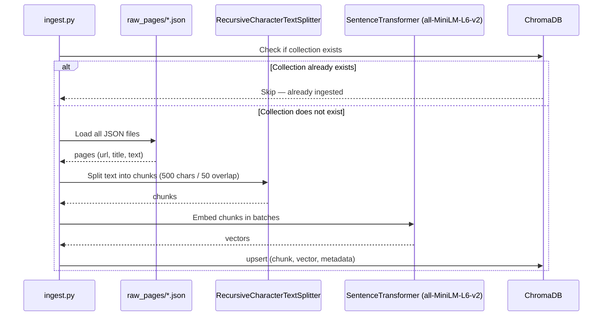
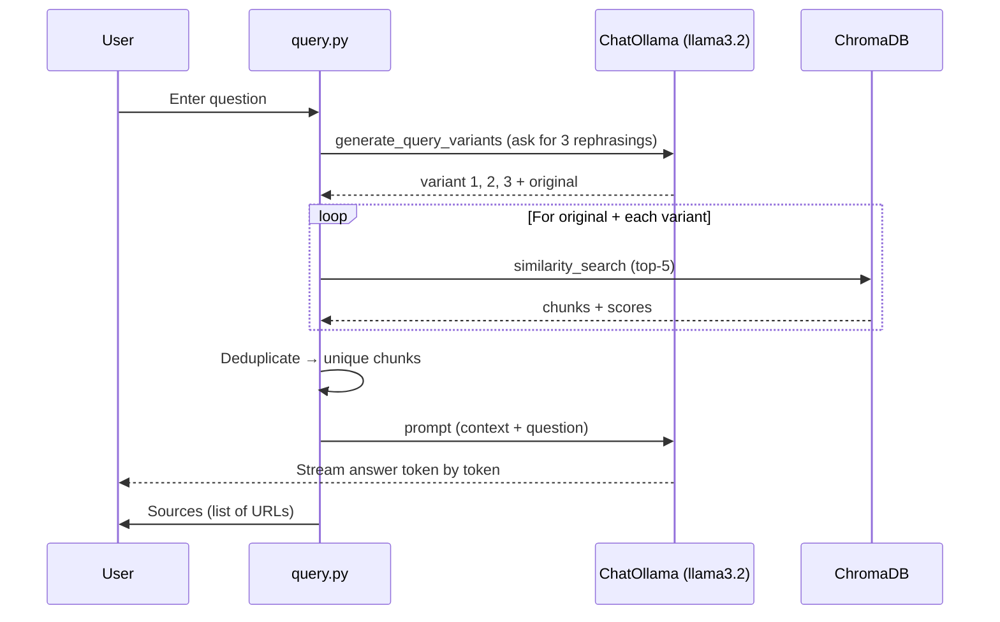

# Google Cloud Next RAG

A local Retrieval-Augmented Generation (RAG) system built on top of the [Google Cloud Next 2026](https://www.googlecloudevents.com/next-vegas) conference website. Everything runs on your machine — no cloud APIs, no data sent anywhere.

## Architecture

### Phase 1 — Scrape

Crawl all pages under `googlecloudevents.com/next-vegas` and save the clean text of each page as a JSON file locally. This is the raw data collection step — no embeddings or AI involved yet.



### Phase 2 — Ingest

Take the scraped JSON files, split them into smaller chunks, convert each chunk into a vector (embedding), and store everything in ChromaDB. This builds the searchable knowledge base that the query step relies on.



### Phase 3 — Query

Accept a question, rephrase it into multiple variants to improve retrieval coverage, fetch the most relevant chunks from ChromaDB, and pass them as context to `llama3.2` to generate a grounded answer — streamed back token by token.



### Components

| Component | Tool | Details |
|---|---|---|
| Web scraper | `aiohttp` + `BeautifulSoup4` | Async, 10 concurrent workers, resumable |
| Text splitter | `langchain-text-splitters` | `RecursiveCharacterTextSplitter`, 500 chars, 50 overlap |
| Embedding model | `sentence-transformers` | `all-MiniLM-L6-v2`, runs fully offline (~90 MB) |
| Vector store | `ChromaDB` | Persistent local storage in `./chroma_db/` |
| LLM | `Ollama` + `llama3.2` | Runs locally, no API key needed |
| RAG chain | `LangChain` LCEL | Multi-query retrieval + streamed answer |

## Prerequisites

1. **Python 3.11+**

2. **Ollama** — install from [ollama.com](https://ollama.com), then pull the model:
   ```bash
   ollama pull llama3.2
   ```

3. **Python dependencies:**
   ```bash
   pip install -r requirements.txt
   ```

## How to Run

### Step 1 — Scrape the site

Crawls all pages under `googlecloudevents.com/next-vegas` and saves them as JSON files.
Safe to interrupt and resume — already-scraped pages are skipped automatically.

```bash
python scraper.py
```

Output: `raw_pages/*.json` and `scraped.log`

### Step 2 — Ingest into ChromaDB

Chunks all scraped pages, embeds them, and stores everything in a local vector database.
Re-running is safe — skips if the collection already exists.

```bash
python ingest.py
```

Output: `chroma_db/` directory

### Step 3 — Ask questions

```bash
python query.py "When is Google Cloud Next 2026?"
python query.py "Who are the keynote speakers?"
python query.py "What sessions are available?"
```

Example output:
```
Question: When is Google Cloud Next 2026?
------------------------------------------------------------

Generating query variants...

[Query variants (4 total)]
  original: When is Google Cloud Next 2026?
  variant 1: What are the dates for Google Cloud Next 2026?
  variant 2: Where and when is the Google Cloud Next conference held?
  variant 3: What is the schedule for Google Cloud Next 2026?

[Retrieved chunks for original query]
  score 0.1214 | Google Cloud Next 2026 – Las Vegas Conference
  score 0.1893 | Google Cloud Next 2026 – Las Vegas Conference
  score 0.2341 | Google Cloud Next 2026 – Las Vegas Conference
  score 0.3102 | Google Cloud Next 2026 – Las Vegas Conference

[Total unique chunks passed to LLM: 8]

------------------------------------------------------------
Answer:

Google Cloud Next 2026 will be held April 22–24, 2026 at the
Mandalay Bay Convention Center in Las Vegas.

Sources:
  - https://www.googlecloudevents.com/next-vegas
```

> **Score note:** Lower = more relevant (cosine distance). Under `0.2` is a strong match, above `0.4` is a weak match.

## How Multi-Query Retrieval Works

A single question like `"When is Google Cloud Next 2026?"` only matches chunks using similar wording. Relevant content might be phrased differently on the site (e.g. "April 22–24", "Las Vegas", "Mandalay Bay").

`query.py` solves this by asking the LLM to generate 3 rephrasings of your question before searching. It then retrieves top-5 chunks per variant, deduplicates, and passes all unique chunks to the LLM as context — giving a broader and more accurate answer.

## Project Structure

```
rag_poc/
├── scraper.py          # Phase 1: async web crawler
├── ingest.py           # Phase 2: chunk, embed, store
├── query.py            # Phase 3: multi-query retrieval + streamed answer
├── requirements.txt    # Python dependencies
├── .gitignore
│
│   # Generated — not committed to git
├── raw_pages/          # scraped JSON files (one per page)
├── scraped.log         # tracks completed URLs for resumability
└── chroma_db/          # ChromaDB vector store
```

> `raw_pages/`, `scraped.log`, and `chroma_db/` are excluded from git.
> Run the three steps above to rebuild them from scratch.
