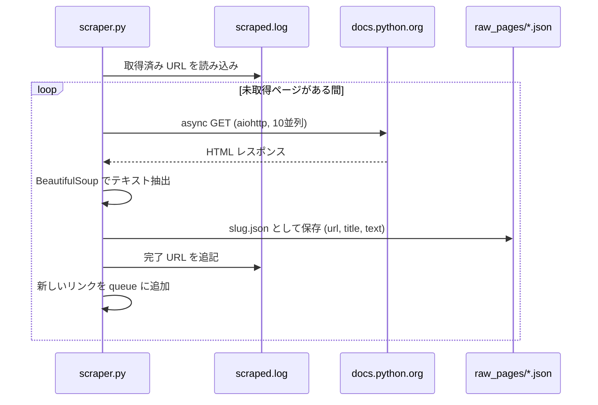
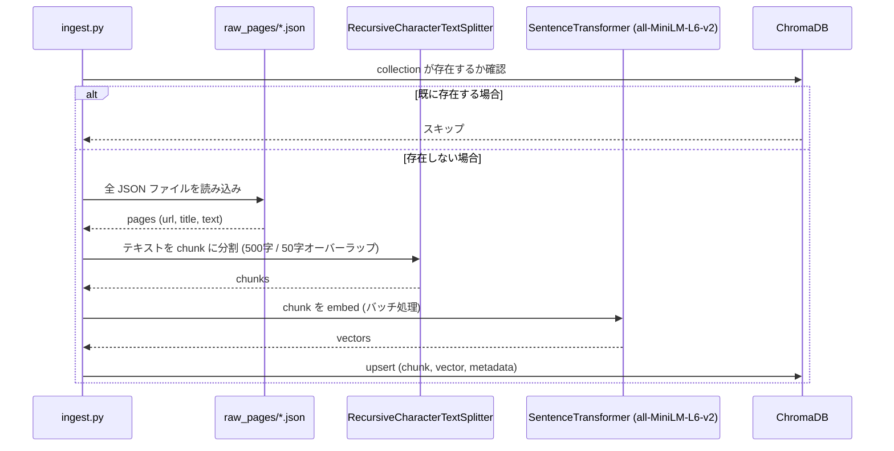
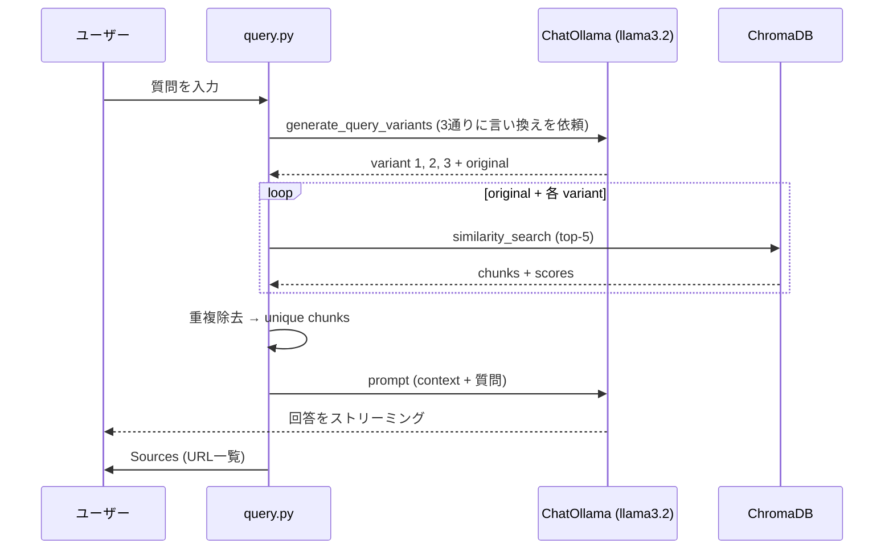

# Python Docs RAG

公式の [Python 3 ドキュメント](https://docs.python.org/3/) をベースにしたローカル RAG（Retrieval-Augmented Generation）システムです。すべての処理は自分のマシン上で完結します。クラウド API は不要で、データが外部に送信されることはありません。

## アーキテクチャ

### Phase 1 — Scrape

`docs.python.org/3/` 配下の全ページをクロールし、各ページのテキストを JSON ファイルとしてローカルに保存します。embedding や AI はまだ使わない、純粋なデータ収集のステップです。



### Phase 2 — Ingest

スクレイピングした JSON ファイルを小さな chunk に分割し、各 chunk を vector（embedding）に変換して ChromaDB に保存します。query ステップが検索に使う知識ベースをここで構築します。



### Phase 3 — Query

質問を受け取り、複数の variant に言い換えて検索範囲を広げ、ChromaDB から最も関連性の高い chunk を取得します。それを context として `llama3.2` に渡し、根拠のある回答をトークンごとにストリーミングで返します。



### 使用コンポーネント

| コンポーネント | ツール | 詳細 |
|---|---|---|
| Web scraper | `aiohttp` + `BeautifulSoup4` | 非同期・10並列・中断再開対応 |
| Text splitter | `langchain-text-splitters` | `RecursiveCharacterTextSplitter`、500字・50字オーバーラップ |
| Embedding model | `sentence-transformers` | `all-MiniLM-L6-v2`、完全オフライン動作（約90MB） |
| Vector store | `ChromaDB` | `./chroma_db/` にローカル永続保存 |
| LLM | `Ollama` + `llama3.2` | ローカル実行、APIキー不要 |
| RAG chain | `LangChain` LCEL | Multi-query retrieval + streaming 回答 |

## 事前準備

1. **Python 3.11 以上**

2. **Ollama** — [ollama.com](https://ollama.com) からインストール後、モデルを取得：
   ```bash
   ollama pull llama3.2
   ```

3. **Python依存ライブラリのインストール：**
   ```bash
   pip install -r requirements.txt
   ```

## 実行手順

### Step 1 — Scrape

`docs.python.org/3/` 配下の全ページをクロールし、JSON ファイルとして保存します。
中断しても安全です。再実行時は取得済みのページは自動でスキップされます。

```bash
python scraper.py
```

出力：`raw_pages/*.json`（約1,000ファイル）と `scraped.log`
所要時間：約2〜3分

### Step 2 — Ingest

スクレイピング済みの全ページをチャンクに分割し、embedding を生成して vector database に保存します。
再実行しても安全です。collection が既に存在する場合はスキップされます。

```bash
python ingest.py
```

出力：`chroma_db/` ディレクトリ
所要時間：Apple Silicon で約1〜2分

### Step 3 — Query

```bash
python query.py "asyncio はどのように動作しますか？"
python query.py "リストとタプルの違いは何ですか？"
python query.py "context manager はどう使いますか？"
```

出力例：
```
Question: asyncio はどのように動作しますか？
------------------------------------------------------------

Generating query variants...

[Query variants (4 total)]
  original: asyncio はどのように動作しますか？
  variant 1: Python の asyncio event loop とは何ですか？
  variant 2: Python で coroutine はどのように schedule されますか？
  variant 3: async/await は内部でどのように動作しますか？

[Retrieved chunks for original query]
  score 0.1823 | asyncio — Asynchronous I/O — Python 3.14.3 doc
  score 0.2104 | asyncio-task — Coroutines and Tasks — Python 3...
  score 0.2341 | asyncio-eventloop — Event Loop — Python 3.14.3
  score 0.2789 | library/concurrent.futures — Python 3.14.3 doc
  score 0.3102 | whatsnew/3.11 — What's New In Python 3.11

[Total unique chunks passed to LLM: 14]

------------------------------------------------------------
Answer:

asyncio は async/await 構文を使って並行処理を記述するための library です。
event loop を使用して coroutine を管理・schedule します...

Sources:
  - https://docs.python.org/3/library/asyncio.html
  - https://docs.python.org/3/library/asyncio-task.html
```

> **score について：** 値が低いほど関連性が高い（cosine distance）。`0.2` 未満は強い一致、`0.4` 以上は一致度が低いことを示します。

## Multi-Query Retrieval の仕組み

`"asyncio はどのように動作しますか？"` という質問は、同じ表現を使った chunk にしかマッチしません。しかし関連するドキュメントは `"event loop のスケジューリング"` や `"coroutine の実行モデル"` など、異なる表現で書かれている場合があります。

`query.py` では、検索前に LLM が質問を3通りに言い換えます。各 variant で上位5件の chunk を取得し、重複を除いたうえで全 chunk を LLM に渡すことで、より広く正確な回答を生成します。

## プロジェクト構成

```
rag_poc/
├── scraper.py          # Phase 1: async web crawler
├── ingest.py           # Phase 2: chunk, embed, store
├── query.py            # Phase 3: multi-query retrieval + streaming 回答
├── requirements.txt    # Python dependencies
├── .gitignore
│
│   # 生成ファイル — git には含まれません
├── raw_pages/          # スクレイピングした JSON ファイル（1ページ1ファイル）
├── scraped.log         # 取得済み URL の記録（再開用）
└── chroma_db/          # ChromaDB vector store
```

> `raw_pages/`、`scraped.log`、`chroma_db/` は `.gitignore` で除外されています。
> 上記の3ステップを実行すれば、いつでも再構築できます。
